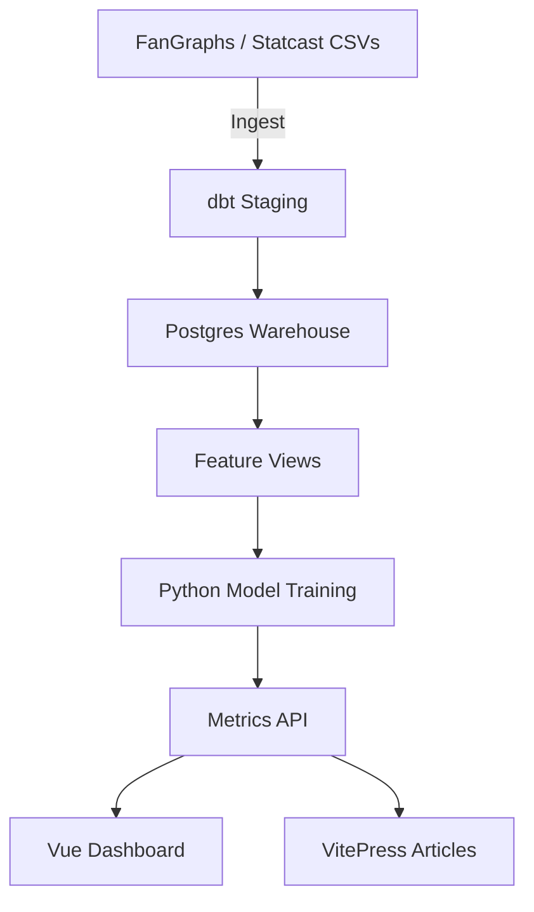

# Modeling Pipeline

The STRIK3 pipeline stitches together Python, SQL, and Vue deliverables so the entire analytics team
can collaborate on a single source of truth.

## Daily Sync

- **Python:** `scripts/query_fantasy_metrics.py` pulls projections and writes them to the warehouse.
- **SQL:** `db/queries/fantasy_metrics.sql` materializes fantasy and prop edges.
- **Orchestration:** Use cron or a lightweight Airflow instance to run the sync pre-lock each day.

## Delivery

1. Publish updated model coefficients via an internal REST endpoint.
2. Trigger the Vue app to refresh TanStack tables and recompute expected fantasy points.
3. Push a changelog article to VitePress so downstream users understand the update.

Document assumptions and validation steps inside the docs site to maintain transparency with bettors
and subscribers.
